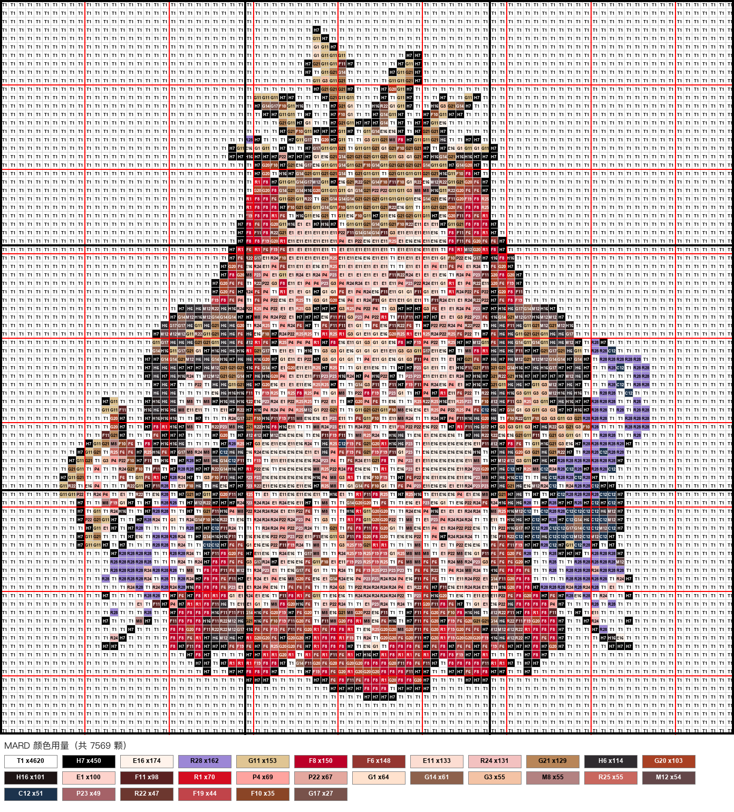
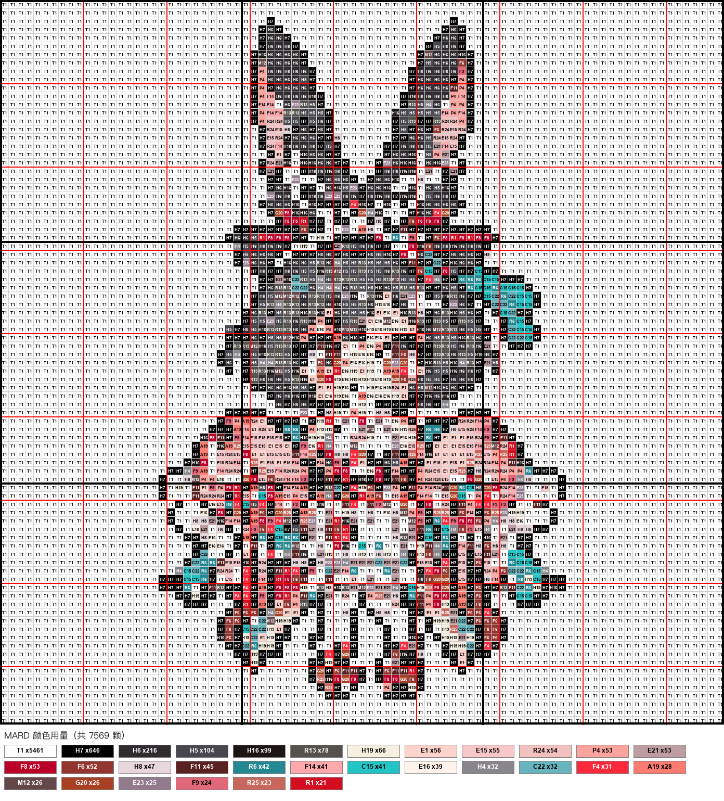
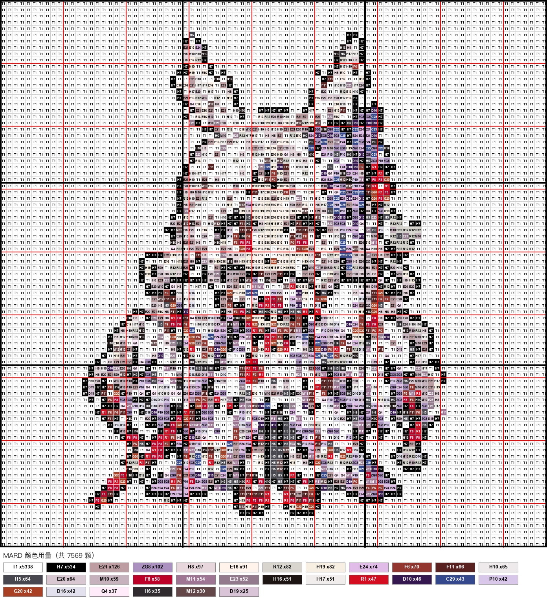

<div align="center">

# 阴阳师拼豆图纸生成器

### 阴阳师立绘 → 标准底板拼豆图纸

上传阴阳师角色或皮肤立绘，在浏览器中完成像素化、MARD 色号映射、背景清理、逐格编辑和图纸导出。

**在线使用：<https://eilaz-06.github.io/yys-PerlerBeads/>**

</div>

## 阴阳师专用预设

- **1 块底板**：29 × 29，适合头像和极简 Q 版
- **4 块底板**：58 × 58，适合普通全身 Q 版
- **9 块底板**：87 × 87，适合典藏皮肤与复杂服饰，默认推荐
- 下载设置默认每 29 格绘制底板分界线
- 默认使用 MARD 色号，仍可切换 COCO、漫漫、盼盼、咪小窝

## 功能

- JPG、PNG、GIF 与 CSV 导入
- 主导色像素化，减少边缘灰色毛边
- BFS 邻近颜色合并与可调阈值
- 边界洪水填充、一键去背景与撤销
- 画笔、橡皮擦、吸管、颜色替换和多步撤销
- 排除颜色并自动映射到近似可用色
- 导出带色号、坐标、网格和用量统计的 PNG
- 导出/重新导入 CSV，继续逐格修改
- 专心拼豆模式与制作进度记录

## 本地运行

```bash
npm install
npm run dev
```

浏览器打开 <http://localhost:3000>。

生产构建：

```bash
npm run build
npm run start
```

## 使用建议

1. 优先上传主体完整、背景干净、轮廓清楚的阴阳师立绘或 Q 版像素稿。
2. 典藏皮肤推荐选择“9 块 / 87×87”。
3. 先调颜色合并阈值，再使用“一键去背景”。
4. 进入手动编辑模式修整脸部、发饰、武器等关键细节。
5. 下载时选择 29 格底板线，并同时导出 CSV 作为可编辑源文件。

## 示例图纸

| 御怨般若·侍怨神婚 | 梦寻山兔·梦游仙境 | 姑获鸟·紫藤花烬 |
|---|---|---|
|  |  |  |

更多图纸可以直接用网页版上传立绘生成。示例仅用于展示工具输出效果。

## 部署

仓库内置 GitHub Pages 工作流。推送到 `main` 后会自动构建并发布静态网页；图片处理全部在浏览器本地完成，不会上传用户图片。

## 上游项目与许可证

本项目基于 [Zippland/perler-beads](https://github.com/Zippland/perler-beads) 修改。感谢原作者公开完整的图像处理、编辑和导出实现。

上游项目采用 [AGPL-3.0](./LICENSE)。本衍生项目继续使用 AGPL-3.0，并保留原始版权与许可证文件。若通过网络向用户提供本项目，也必须向用户提供对应源代码。

本项目与网易或《阴阳师》官方无隶属、授权或合作关系；游戏名称与相关素材权利归各自权利人所有。本工具仅用于个人拼豆设计与学习。
